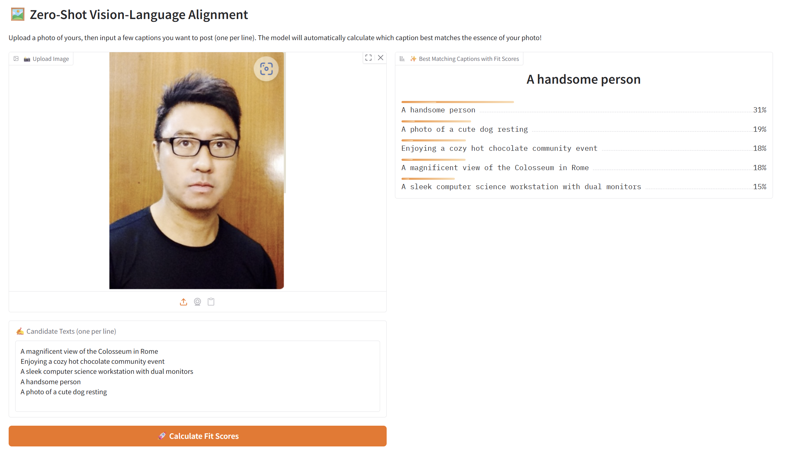

# Zero-Shot Vision-Language Feature Alignment via Contrastive Learning

**DONG, Yunao** — ydongbd@connect.ust.hk

**LIU, Xiyue** — xliufp@connect.ust.hk

**CHEN, Hongyu** — hchendu@connect.ust.hk

---

## Overview

This project implements a **CLIP-style dual-encoder model** that aligns images and text in a shared embedding space via contrastive learning. The model is trained on the **COCO Captions** dataset and can perform **zero-shot image-text retrieval** and **zero-shot classification** on unseen datasets like ImageNet and CIFAR-100.

### Key Features

- **Dual-encoder architecture**: ViT-B/16 image encoder + frozen CLIP text encoder
- **Contrastive learning**: Symmetric InfoNCE loss with learnable temperature
- **Zero-shot transfer**: Classify images from unseen categories using natural language prompts
- **Interactive demo**: Gradio web interface for real-time image-text matching

---

## Model Architecture

```
Image ──► ViT-B/16 ──► Image Projection ──► Image Embedding [B, 256] ────┐
                                                                          │
                                                                   InfoNCE Loss
                                                                          │
Text  ──► CLIP Text Encoder ──► Text Projection ──► Text Embedding [B, 256] ─┘
          (frozen)
```

| Component | Specification | Params | Trainable |
|-----------|--------------|--------|-----------|
| Image encoder | ViT-B/16 (torchvision, ImageNet-pretrained) | ~86M | Yes (lr=1e-5) |
| Text encoder | `openai/clip-vit-base-patch32` (HuggingFace) | ~63M | Frozen |
| Image projection | Linear(768→256) → GELU → Linear(256→256) | ~0.26M | Yes (lr=3e-4) |
| Text projection | Linear(512→256) → GELU → Linear(256→256) | ~0.20M | Yes (lr=3e-4) |
| Logit scale | 1 scalar | 1 | Yes |
| **Total** | | **~149M** | |
| **Trainable** | | **~86.5M** | |

---

## Main Results

### COCO Retrieval (Strict One-Caption Protocol)

| Metric | Value |
|--------|:-----:|
| Image→Text R@1 | 24.88 |
| Image→Text R@5 | 54.22 |
| Image→Text R@10 | 68.00 |
| Text→Image R@1 | 24.58 |
| Text→Image R@5 | 54.28 |
| Text→Image R@10 | 68.18 |
| Mean Recall | 49.02 |

### Zero-Shot Transfer

| Dataset | Top-1 Accuracy | Top-5 Accuracy |
|---------|:--------------:|:--------------:|
| CIFAR-100 | 37.21% | 67.03% |
| ImageNet-1K | 19.55% | 42.08% |

### Baseline Comparison (ResNet-50)

A ResNet-50 baseline is also provided for ablation. See the [baseline report](reports/baseline_resnet50_report.md) for details.

| Metric | ResNet-50 (Baseline) | ViT-B/16 (Main) |
|--------|:-------------------:|:----------------:|
| Mean Recall | 30.67 | 49.02 |
| Image→Text R@1 | 11.84 | 24.88 |

---

## Quick Start: Interactive Demo

### Step 1: Download the pretrained model

Download the best checkpoint from HuggingFace:

```bash
# Install huggingface-cli if needed
pip install huggingface-hub

# Download the model checkpoint
huggingface-cli download Chris-Hornet-Dong/comp4471-cliptext --local-dir ./checkpoints/coco_3gpu_cliptext
```

Or download manually from: https://huggingface.co/Chris-Hornet-Dong/comp4471-cliptext/tree/main

Place the downloaded `best.pt` into `checkpoints/coco_3gpu_cliptext/`.

### Step 2: Install dependencies

```bash
pip install -r requirements.txt
```

### Step 3: Run the Gradio app

```bash
python app.py
```

This will launch a web interface at `http://localhost:7860` where you can:

1. Upload an image
2. Enter multiple candidate text descriptions (one per line)
3. Click **"Calculate Fit Scores"** to see which caption best matches your image

---

## Training from Scratch

### Demo (Quick Test)

```bash
# 1. Generate demo data
python make_demo_data.py

# 2. Train on demo data
python train.py --config configs/demo.yaml

# 3. Evaluate
python evaluate.py --config configs/demo.yaml --checkpoint checkpoints/demo/best.pt
```

### Full COCO Training

1. Download COCO 2017 dataset to `data/coco/`:
   - Annotations: `data/coco/annotations/captions_train2017.json`, `captions_val2017.json`
   - Images: `data/coco/train2017/`, `data/coco/val2017/`

2. Train the model:
   ```bash
   python train.py --config configs/coco_3gpu_cliptext.yaml
   ```

3. Evaluate on COCO retrieval:
   ```bash
   python evaluate.py --config configs/coco_3gpu_cliptext.yaml --checkpoint checkpoints/coco_3gpu_cliptext/best.pt
   ```

4. Zero-shot evaluation on ImageNet:
   ```bash
   python evaluate_imagenet.py \
     --config configs/coco_3gpu_cliptext.yaml \
     --checkpoint checkpoints/coco_3gpu_cliptext/best.pt \
     --imagenet-root /path/to/imagenet/val \
     --class-index-json /path/to/imagenet_class_index.json
   ```

### Baseline (ResNet-50) Training

```bash
# Train
python baseline/train.py --config baseline/config.yaml

# Evaluate
python baseline/evaluate.py --config baseline/config.yaml --checkpoint checkpoints/baseline_resnet50/best.pt
```

---

## Project Structure

```
├── app.py                          # Gradio interactive demo
├── inference.py                    # Inference utilities
├── train.py                        # Main training script
├── evaluate.py                     # COCO retrieval evaluation
├── evaluate_imagenet.py            # ImageNet zero-shot evaluation
├── evaluate_transfer.py            # CIFAR-10/100 zero-shot evaluation
├── make_demo_data.py               # Demo data generator
├── configs/                        # Training configurations
│   ├── default.yaml
│   ├── demo.yaml
│   ├── coco_3gpu_cliptext.yaml     # Main model config
│   └── ...
├── models/                         # Model definitions
│   ├── clip_model.py               # Main CLIP model (ViT-B/16)
│   ├── image_encoder.py            # Image encoder builder
│   └── text_encoder.py             # Text encoder wrapper
├── data/                           # Dataset and transforms
│   ├── dataset.py
│   ├── build.py
│   └── transforms.py
├── utils/                          # Loss functions and metrics
│   ├── losses.py
│   └── metrics.py
├── baseline/                       # ResNet-50 baseline
│   ├── dual_encoder_model.py
│   ├── train.py
│   ├── evaluate.py
│   ├── config.yaml
│   └── ...
├── reports/                        # Reports and figures
│   ├── cliptext_experiment_report.md
│   ├── baseline_resnet50_report.md
│   └── figures/
│       ├── demo.png
│       ├── coco_3gpu_cliptext_loss_curve.png
│       ├── coco_similarity_heatmap.png
│       └── coco_topk_retrieval_examples.png
└── scripts/                        # Utility scripts
    ├── plot_loss_curve.py
    ├── visualize_retrieval.py
    └── ...
```

---

## Environment

```bash
pip install -r requirements.txt
```

---

## Citation

```bibtex
@misc{comp4471-cliptext,
  author = {Dong, Yunao and Liu, Xiyue and Chen, Hongyu},
  title = {Zero-Shot Vision-Language Feature Alignment via Contrastive Learning},
  year = {2026},
  howpublished = {GitHub repository},
  url = {https://github.com/Leochen219/COMP4471_Project}
}
```
